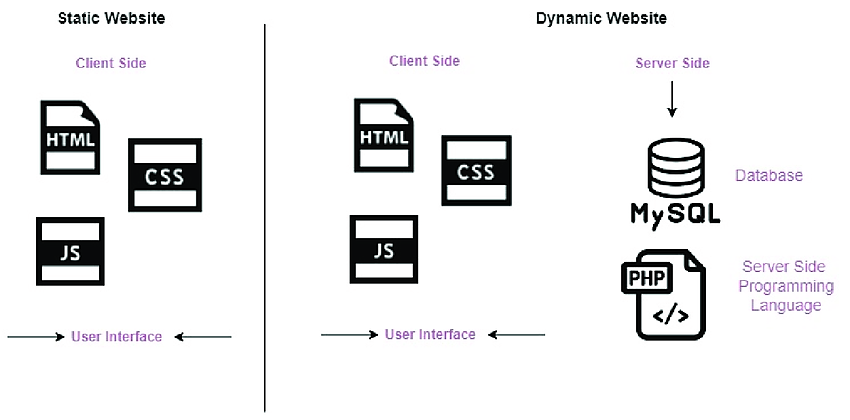

# Complete Guide to Web Development
<picture>
 <source media="(prefers-color-scheme: light)" srcset="YOUR-LIGHTMODE-IMAGE">
 
</picture>

**Congratulations on making a very smart decision to learn web development!**

Having this book in your possession, it's clear that you have an enthusiasm for learning **web development** and a strong commitment to achieving your goals. This book is designed to be a comprehensive guide for beginners, guiding us through the basics of **web development**. In this chapter, we will try to answer any questions that might come up before we begin our journey.

**Web development** is the process of creating, maintaining and improving websites and web applications. It includes both the design and coding aspects of web development and can involve a range of skills from HTML and CSS programming to software engineering, database development, server setup, and content management. Web developers use a variety of languages, frameworks, and tools to create a website or application that meets the requirements of the client or organization. Web development is an ever-evolving field with new technologies emerging every day. The web development process is complex and involves many different parts and players. It is important to understand the different roles and responsibilities of those involved in the process in order to create a successful product.

Welcome to this book! Whether you are a complete beginner or an experienced developer looking to brush up your skills, this guide will provide you with all the knowledge you need to become a successful web developer. This comprehensive guide covers the essential concepts and tools of web development, including HTML, CSS, JavaScript, web frameworks, databases, web APIs, and more. With this guide, you will learn the fundamentals of web development, as well as the latest technologies and trends, so that you can create modern and powerful web applications. So, let's get started!

## Table of Contents
* [<i>Preface</i>](#preface)
* [<b>Chapter-01: Introduction to Web Development</b>](#chapter-01)		              	
    * [What is Website?](what-is-website?)
	* [Types of Websites]()
	* [Website structure]()
    * [What is Web Development?]()
    * [What do Web Developers do?]()
    * [Types of Web Developers]()
    * [Web Design vs. Web Development]()
    * [UI/UX]()
    * [What is an IP address?]()
	* [Web Application]()
	* [What is cybersecurity?]()
* [Chapter 02 - Introduction To Python Programming](#chapter-02---introduction-to-python-programming)
* [Chapter 03 - Introducing Methods](#chapter-03---introducing-methods)
* [Chapter 04 - Introduction To Python Platform](#chapter-04---introduction-to-python-platform)
* [Chapter 05 - Introduction To PyCharm](#chapter-05---introduction-to-pycharm)
* [Chapter 06 - Introducing Data Types and Conditionals](#chapter-06---introducing-data-types-and-conditionals)
* [Chapter 07 - Introducing Loops](#chapter-07---introducing-loops)
* [Chapter 08 - Python Tips](#chapter-08---python-tips)
* [Chapter 09 - Introducing Object Oriented Programming](#chapter-09---introducing-object-oriented-programming)
* [Chapter 10 : Python Data Structures](#chapter-10---python-data-structures)
* [Chapter 11 - Object Oriented Programming Revisited](#chapter-11---object-oriented-programming-revisited)
* [Chapter 12 - Error Handling](#chapter-12---error-handling)
* [Chapter 13 - More Python Tips](#chapter-13---more-python-tips)

## Chapter-01
## Introduction to Web Development

### What is website?

A website is a collection of related web pages, including multimedia content, typically identified with a common domain name, and published on at least one web server. A website may be accessible via a public Internet Protocol (IP) network, such as the Internet, or a private local area network (LAN), by referencing a uniform resource locator (URL) that identifies the site.
Websites can have many functions and can be used in various fashions; a website can be a personal website, a corporate website for a company, a government website, an organization website, etc. Websites are typically dedicated to a particular topic or purpose, ranging from entertainment and social networking to providing news and education. All publicly accessible websites collectively constitute the World Wide Web.
Websites can be created and maintained by an individual, group, business or organization to serve a variety of purposes. A website is hosted on a computer system known as a web server, also called an HTTP (Hyper Text Transfer Protocol) server. These terms can also refer to the software that runs on these systems which retrieves and delivers the web pages in response to requests from the website's users. Apache is the most commonly used web server software.
 <picture>
 <source media="(prefers-color-scheme: light)" srcset="YOUR-LIGHTMODE-IMAGE">
 
</picture>
Static website: A static website is one that has web pages stored on the server in the format that is sent to a client web browser. It is primarily coded in Hypertext Markup Language (HTML); Cascading Style Sheets (CSS) are used to control appearance beyond basic HTML. Images are commonly used to effect the desired appearance and as part of the main content. Audio or video might also be considered "static" content if it plays automatically or is generally non-interactive. This type of website usually displays the same information to all visitors. Similar to handing out a printed brochure to customers or clients, a static website will generally provide consistent, standard information for an extended period of time. Although the website owner may make updates periodically, it is a manual process to edit the text, photos and other content and may require basic website design skills and software. Simple forms or marketing examples of websites, such as classic website, a five-page website or a brochure website are often static websites, because they present pre-defined, static information to the user. This may include information about a company and its products and services through text, photos, animations, audio/video, and navigation menus.
Dynamic website: A dynamic website is one that changes or customizes itself frequently and automatically. Server-side dynamic pages are generated "on the fly" by computer code that produces the HTML (CSS are responsible for appearance and thus, are static files). There are a wide range of software systems, such as CGI, Java Servlets and Java Server Pages (JSP), Active Server Pages and ColdFusion (CFML) that are available to generate dynamic web systems and dynamic sites. Various web application frameworks and web template systems are available for general-use programming languages like Perl, PHP, Python and Ruby to make it faster and easier to create complex dynamic websites.
Types of websites
There are so many types of websites available in the internet and we cannot go into detail about every type of website, so instead we will focus on some of the more common ones.

1.	Informational Websites – These websites provide information to the user in a variety of formats such as text, images, videos, audio and animations. They can be used for educational purposes, to provide news and updates, to advertise products or services, or to provide entertainment.
2.	E-commerce Websites – These websites are used for conducting online transactions. They allow users to purchase products or services through a secure payment gateway. The payment gateway is integrated into the website and customers can pay with a credit card or other payment methods.
3.	Social Networking Websites – These websites allow users to build profiles, share photos and videos, interact with friends and family, join groups, and more. They are used for connecting people all over the world and can be used to promote businesses or products.
4.	Blogging Websites – These websites allow users to create and manage their own blog. They can be used to express opinions, share experiences and expertise, and discuss topics of interest
5.	Discussion Forums – These websites allow users to ask questions and receive answers from a community of experts and enthusiasts. They are used to discuss topics of interest and provide support to each other.
6.	Video Sharing Websites – These websites allow users to upload, share, and watch videos. They can be used to share videos of events, tutorials, and other videos of interest.
7.	Image Sharing Websites – These websites allow users to upload, share, and view images. They can be used to share photographs of events, images of artwork or projects, and other images of interest.
8.	News Websites – These websites provide news, stories, and updates from a variety of sources. They can be used to stay informed about current events and other topics of interest.
9.	Music Streaming Websites – These websites allow users to stream and listen to music from a variety of sources. They can be used to discover new music and explore different genres.
10.	File Sharing Websites – These websites allow users to upload and share files with other users. They can be used to share documents, images, videos, and other types of files.

Website structure
Designers strive to create products and experiences that will bring joy to users. However, when designing a website or landing page, there are other factors to consider, such as the structure of the site. This structure involves the information architecture and design layout, which is the structural projection of an informational space that facilitates easy access to content. Having an organized structure is important for user experience, as it allows customers to quickly find what they need. If the site is not organized, customers may leave and never come back. To ensure that your website is properly organized, you can utilize the tool of structure.
 
The four types of web structure that are common in UX design are:
1.	Hierarchical structure: Hierarchical models create a main page from which child pages (categories and sub-categories) branch off. 

 

2.	Sequential structure: Sequential models are used when users need to go through steps or any 
other sequence.
 

3.	Matrix structure: Matrix models are often seen in newspapers, such as New York Times, where the structure is less clear. 
 
4.	Database model: Database models are used for sites that have a lot of user-generated content.
The home page of a website serves as the hub, linking to critical or popular pages. Categorization is important to help users make decisions faster, while subcategories provide a structured approach to browsing complex data. Individual posts and pages should have a meaningful information hierarchy to make it easier for users to find the content they need.
What is Web Development?
Web development is the process of creating and maintaining websites. It includes many aspects such as web design, web content development, server-side scripting, client-side scripting, network security configuration, and e-commerce development.
Web design involves the creation of webpages, graphics, and other visuals. Web content development refers to the process of writing and updating webpages. Server-side scripting is the programming of web applications, such as server-side databases and dynamic content. Client-side scripting is the programming of client-side web applications, such as Javascript. Network security configuration is the process of setting up and maintaining firewalls, encryption protocols, and other security measures. E-commerce development is the process of creating and managing online stores.
Web development is an ever-evolving field, and new technologies are constantly being developed and implemented. It is important for web developers to stay up to date on the latest trends and technologies in order to stay competitive in the industry. Additionally, web developers must be knowledgeable in coding languages such as HTML, CSS, JavaScript, Ruby, and PHP. Knowledge of software such as Adobe Creative Suite and Microsoft Office is also useful for web developers.
What do Web Developers do?
Web developers design, create, and maintain websites and web applications. They are responsible for coding, designing, testing, and debugging websites, web applications, and web-related software. They work with HTML, CSS, JavaScript, and other web programming languages to create websites and web apps that are attractive, functional, and user-friendly. They also ensure that websites are optimized for search engine results and are compatible with multiple browsers and platforms. Web developers may also be responsible for managing databases, creating content, and ensuring the security of websites.
Types of Web Developers
There are three types of web developer roles: front-end, back-end, and full-stack.

1.	Front-End Developer: A front-end developer is responsible for building the user interface of a website. They code the design elements of the site, making sure that it looks and functions as intended. They use a combination of HTML, CSS, and JavaScript to create the visuals and functionality of the website.
2.	Back-End Developer: A back-end developer builds the foundation of a website. They use programming languages such as PHP, Ruby on Rails, and Python to create the server-side components of the website. This includes data storage and retrieval, database management, and application logic.
 
3.	Full-Stack Developer: A full-stack developer is a combination of both a front-end and back-end developer. They are responsible for the entire development process, from design to coding to testing and deployment. They are proficient in multiple programming languages and understand how the various components of the website interact with each other.
Web Design vs. Web Development
A web designer is a creative individual who is responsible for developing the overall look, usability, and aesthetic of a website. On the other hand, a web developer is responsible for constructing, maintaining the framework and coding of a website using programming languages such as HTML, JavaScript, PHP, and Python. For both positions, technical, graphic and creative skills are essential. Here are some comparisons between web design and 
1.	Web Design focuses on the look and feel of a website, while Web Development focuses on the functionality of a website.
2.	Web Design involves creating the visual layout of a website, while Web Development involves writing code to make a website functional. 
3.	Web Designers use HTML, CSS, and JavaScript to create the visual elements of a website, while Web Developers use server-side coding languages such as PHP and ASP.NET to create a website’s functionality. 
4.	Web Designers can create images, layouts, and other visual elements for a website, while Web Developers write code to control the functionality of a website. 
5.	Web Designers focus on the user experience of a website, while Web Developers focus on the technical aspects of a website. 
6.	Web Designers are responsible for the overall look and feel of a website, while Web Developers are responsible for the underlying code and functionality.
UI/UX
Creating a product that individuals enjoy frequently necessitates both a nice UI and UX. As an example, you could have a banking app with an attractive interface and user-friendly navigation (UI). But if the app has slow loading times or requires you to go through multiple screens to transfer money (UX), the look of the app does not matter. You would not be likely to want to use it. On the other hand, a website could be full of interesting, beneficial content that is organized in a sensible and easy to understand manner. However, if the website appears outdated or if you can't easily figure out how to navigate between screens or scroll through options, you are likely to move away from the website.
User Interface (UI):
1.	Design: UI should be designed in a way that is user-friendly and intuitive. The design should be responsive, modern, and aesthetically pleasing.
2.	Navigation: Menus should be easy to navigate and organized in a logical way.
3.	Interaction: The user should be able to interact with the interface easily and efficiently.
4.	Feedback: The interface should provide clear feedback to the user when they take an action.
User Experience (UX):
1.	Usability: The interface should be easy to use and understand.
2.	Accessibility: The interface should be accessible to all users, regardless of ability or disability.
3.	Context: The interface should take into account the user’s context and adapt accordingly.
4.	Engagement: The interface should be engaging and encourage users to come back and use it.

What is an IP address?
An IP address is a unique numerical identifier given to any device connected to a network that uses Internet Protocol for communication, similar to a mailing address associated with a home or workplace. To send data over this network, it is broken down into pieces called packets, which contain the data itself as well as metadata in the form of a header. Included in this header are the IP addresses of the sending and receiving devices. Routers and other network infrastructure use this information to direct the packets to their intended destination.
   
IP addresses are usually written and displayed in human-readable notations, such as 208.67.222.222 in IPv4, and 2001:db8:0:1234:0:567:8:1 in IPv6. The Internet Protocol, version 4 (IPv4) defines an IP address as a 32-bit number. However, because of the growth of the Internet and the depletion of available IPv4 addresses, a new version of IP (IPv6), using 128 bits for the IP address, was developed in 1995, and standardized in 1998. IPv6 deployment has been ongoing since the mid-2000s.
IP addresses are classified into two categories: public and private. Public IP addresses are globally routable on the Internet, while private IP addresses are not. Private IP addresses are commonly used in home and business networks.
IP addresses can also be used to track the geographical location of a device. This is done by comparing the IP address of the device to a database of known locations. This is how services such as geolocation are able to determine a user's location.
Find IP Address of a Domain, Server or Website: https://www.site24x7.com/find-ip-address-of-web-site.html
Web application
Web applications are applications that are accessed over a network such as the Internet or an intranet. They are also known as web-based applications or hosted applications. A web application typically requires a web server and a database to store its information and is written using a combination of web technologies such as HTML, CSS, JavaScript, and AJAX.
The primary benefit of using a web application is that it can be accessed from any device with an Internet connection. This means that users can access the application from anywhere in the world, making it easier to collaborate and share information. Additionally, web applications can be more secure than traditional desktop applications since the information is stored on the server instead of the individual devices.
Web applications are becoming increasingly popular for both businesses and consumers as they can provide a more seamless experience across multiple devices. For businesses, web applications can help to reduce costs and increase efficiency. For consumers, web applications can provide an easy way to access information and services from any device.
What is cybersecurity?
Cybersecurity, also known as information technology security, is the practice of protecting networks, systems, and programs from digital attacks. These attacks are usually aimed at accessing, changing, or destroying sensitive information, extorting money from users, or interrupting normal business processes. Cybersecurity is a combination of technologies, processes, and practices designed to protect networks, devices, programs, and data from attack, damage, or unauthorized access. It includes protecting against risks posed by individuals or groups, either inside or outside of an organization. Cybersecurity measures can include firewalls, encryption, identity management, and other tools that help protect the confidentiality, integrity, and availability of data. Additionally, organizations must implement policies and procedures to make sure that their cybersecurity measures are effective and up to date.

In order to begin web development, some preliminary tasks need to be performed on your laptop or computer. This is about properly configuring your system for development purposes. If you are new to this, then you don't need anything extra to start working with HTML as most computers come with a text editor that is suitable for running HTML codes. However, for more advanced web development, you will need to install some software and do some further configuration. In this chapter, we will endeavor to gain a vast amount of knowledge that will prove useful to us as web developers.
The good news is that there's a plethora of web development tools out there, making the task of finding the best ones a bit tricky. But, what are web development tools and why are they so useful? Web development tools are software and apps that give developers the ability to debug and test the code and interface of a website or application. In other words, they are the products used to create functional sites and apps. 
These tools help developers create attractive, functional, and user-friendly websites and apps in a shorter amount of time. Plus, there are some characteristics that you should look for when choosing the best web development tools. They should be easy to use, integrate smoothly, keep your data secure, be scalable, and fit into your budget.
Web Development has become more complicated recently, making it an intimidating task for those who are new to it and want to go further. However, with the right direction, taking the first steps in web development can be straightforward! A clear guide is all that is needed to get started.

 

Installing the Utilities
At the very first of the journey you don’t actually need to be so worried about this matter. You will be able to learn everything you need with the progress of your practices. As you have just started to write your code you can run HTML in your notepad that you already have with your operating system of the computer. Write your HTML code there and save with the extension “.html” that will actually convert it to the web page. Later 

IDE
An integrated development environment (IDE) is a software application that provides developers with a range of tools to help create programs. It typically includes a source code editor, local build automation tools, and a debugger to help identify and fix bugs in the code. The source code editor provides features such as syntax highlighting and visual cues, language-specific auto-completion, and bug checking as code is written. The local build automation tools assist with tasks such as compiling source code into binary code, packaging binary code, and running automated tests. The debugger helps locate and fix bugs in the original code.
Developers use integrated development environments (IDEs) to quickly create new applications. An IDE combines common developer tools such as a source code editor, local build automation, and a debugger into a single graphical user interface (GUI). This eliminates the need to manually configure and integrate multiple utilities, and it can help new developers quickly get up to speed with a team's standard tools and workflows. IDEs can also save time by providing features such as intelligent code completion and automated code generation. Additionally, they can help developers organize their workflow and debug their code with features such as syntax highlighting, class and object browsers, and class hierarchy diagrams. Although building your own IDE with a lightweight text editor is an option, the time saved, environment standardization, and automation features of modern IDEs often make them the best choice for enterprise development teams.
Example: Microsoft Visual Studio
Setting Up VS Code
Visual Studio Code, also known as VS Code, is a source-code editor created by Microsoft utilizing the Electron Framework, compatible with Windows, Linux, and macOS. It features debugging support, syntax highlighting, intelligent code completion, code snippets, code refactoring, and built-in Git. This product is a popular choice for developers due to its ability to be upgraded to meet specific needs through its extension library. It can be used for a variety of web development tasks and supports TypeScript, JavaScript, and Node.js. Moreover, it can be integrated with other products for additional features.
Download VS Code from https://code.visualstudio.com/download and install on your device. Create a new file and get an idea of the user interface. Then, add language support for your preferred programming language. You can also modify your keyboard shortcuts and move from other editors by using keymap extensions. Finally, personalize your editor with themes and discover the different features of VS Code in the Interactive Editor Playground.
 
To save an HTML file you have to add an extension “.html” at the end of the file name. 
Some Keyboard Hacks:
•	Shift + Alt + Down arrow key  To duplicate the line(s).
•	Tab key  To change the option or select the attributes.
•	Type '!' and press Tab or enter key to open the syntax.
•	Ctrl + /  To comment it out.
•	Ctrl + Alt + down arrow key  To write the same thing in multiple fields.
•	Ctrl + f  To replace.
•	Ctrl + z  To word wrap.

GitHub
GitHub is a web-based hosting service for version control using Git. It is a platform that allows developers to store their projects and track the changes they make to them. It also allows users to collaborate on projects, review code, manage projects, and deploy applications. GitHub provides access control and collaboration features such as wikis, task management, and bug tracking.
Figma
Figma is a cloud-based design and prototyping platform that helps teams create, test, and ship better designs faster. It is used by UX/UI designers, product managers, developers, and marketers to streamline their design process, collaborate more effectively, and quickly iterate on designs. It provides features such as real-time collaboration, version control, integrated prototyping, auto-layout, and more. Figma is available on the web, Mac, Windows, and Linux.

Netlify

